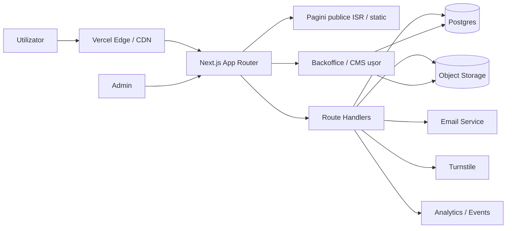
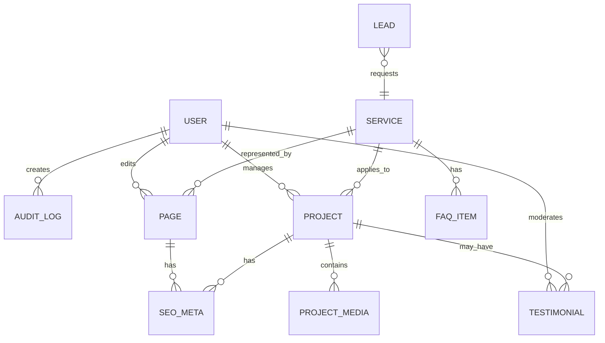
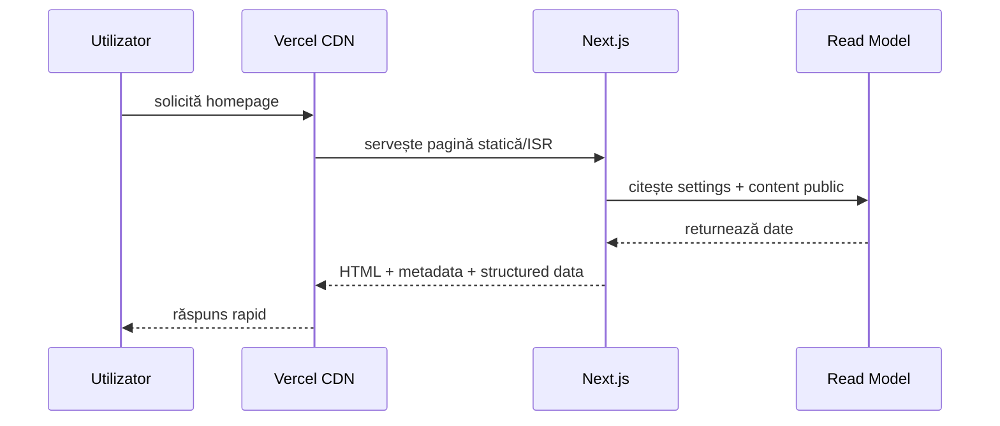
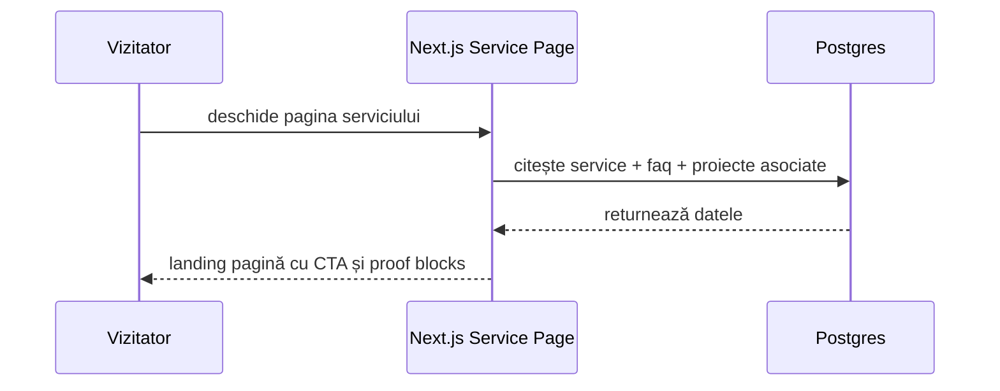
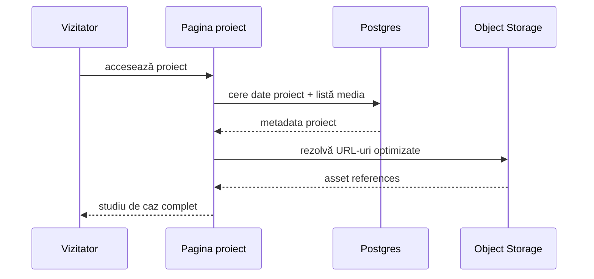
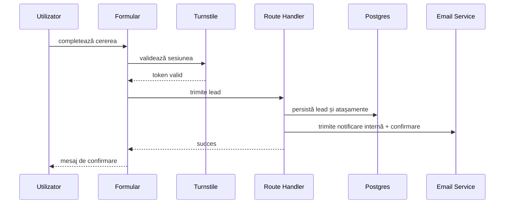
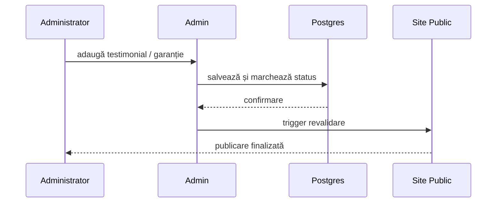
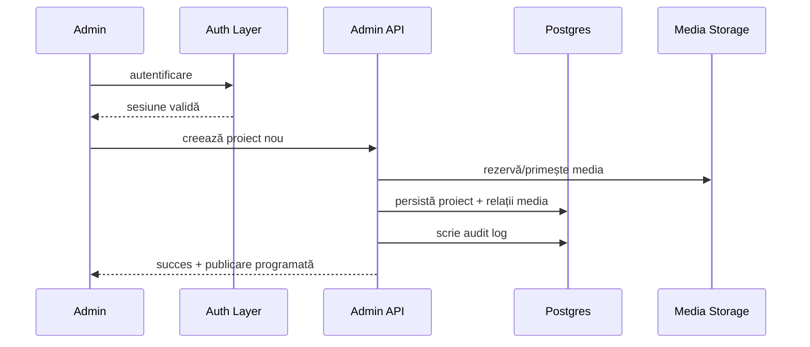
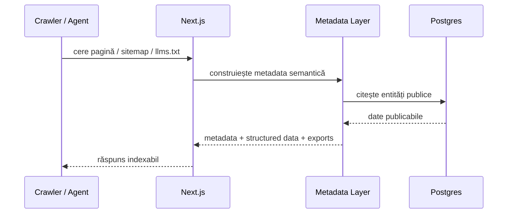
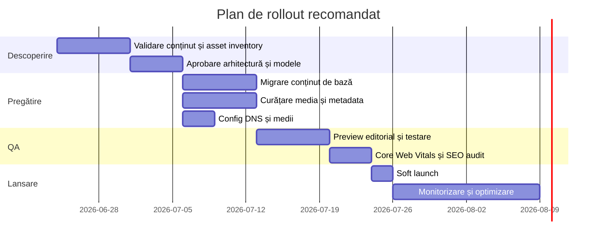

# Faza de arhitectură și descoperire produs pentru platforma premium Meșter Teracotă Moldova

## Sinteză executivă

Documentul atașat descrie o nevoie clară: un website premium, orientat pe conversie, pentru servicii de montare gresie, faianță și renovare de băi în Chișinău/Moldova, cu accent pe diferențiere prin calitate vizuală, încredere, portofoliu, recenzii, lead capture și o fundație SEO/LLM bună, fără a intra încă în implementare sau cod. Cerințele-cheie din brief impun explicit o fază de Architecture & Product Discovery, cu livrabile textuale, decizii motivate, constrângeri Vercel și fără pornirea dezvoltării înainte de aprobare. fileciteturn0file0

Recomandarea mea fermă este un **stack orientat pe marketing-site performant, cu capabilități operaționale ușoare**, nu o platformă complexă de marketplace și nici un CMS enterprise heavy. Asta înseamnă: **Next.js App Router pe Vercel Pro**, conținut public preponderent static/ISR, **Route Handlers** pentru formulare și integrații server-side, **Postgres** pentru entități operaționale și editoriale structurale, plus un strat separat pentru media și imagini. Next.js recomandă Server Components ca model implicit, iar Route Handlers în `app` sunt potriviți pentru request/response custom fără a amesteca inutil API Routes vechi. citeturn53view0turn53view3turn14view2

Din perspectiva produsului, site-ul trebuie proiectat în jurul a șase module: **site public & navigație**, **pagini de servicii**, **portofoliu/studii de caz**, **captură de lead și estimare**, **încredere & reputație**, **admin/CMS/media & analytics**. Aceste module acoperă atât funnel-ul public, cât și operațiunile minime necesare pentru actualizare de conținut, publicare proiecte, moderare lead-uri și măsurare conversii. Platformele comparabile confirmă această direcție: 999.md și RemontMD pun accent pe imagini, experiență, garanție, contact rapid și categorii clare, în timp ce Block, Houzz, Checkatrade și StarOfService excelează la planificare, comparație de opțiuni, reputație și structurarea cererii prin flow-uri ghidate. citeturn47view0turn46view0turn44view1turn44view2turn44view3turn48view0

Pe Vercel, constrângerile sunt importante și influențează arhitectura. **Hobby este pentru uz personal, necomercial**, deci pentru un business real trebuie ales minimum **Pro**. Vercel creează **preview deployments pentru fiecare push/PR**, permite promovare controlată spre producție și rollback rapid, iar variabilele de mediu sunt separate pe **Development / Preview / Production**. În același timp, o politică CSP bazată pe nonce impune randare dinamică, dezactivează optimizări statice și complică caching-ul CDN, deci pentru un site de prezentare premium trebuie evitată aplicarea globală a unei nonce-based CSP și preferată o politică strictă, dar compatibilă cu livrarea statică, pe cât posibil, cu minim de third-party scripts. citeturn49view2turn51view1turn51view2turn52view2turn30view1

Din punct de vedere SEO și descoperire locală, arhitectura trebuie să susțină încă de la început: **Schema.org pentru LocalBusiness/HomeAndConstructionBusiness/Service**, sitemap, robots, structură URL curată, pagini de servicii bine separate, imagini optimizate, semnale de experiență (Core Web Vitals) și, dacă se va extinde la versiune rusă sau engleză, `hreflang` corect. Google cere reprezentare fidelă a businessului în Google Business Profile, o singură fișă per business, adresă/service area corecte și categorii puține, relevante; pentru afaceri care merg la client, adresa rezidențială nu ar trebui afișată public dacă nu funcționează ca storefront. citeturn27view0turn27view1turn27view3turn42view0turn42view1turn42view2turn41view0

În materie de securitate și conformitate, sistemul trebuie tratat ca o platformă de prelucrare de date personale, chiar dacă volumetric este mic: formular de ofertă, date de contact, imagini încărcate, eventual adrese de proiect, testimoniale și conversații. În Republica Moldova, CNPDCP indică explicit că Legea nr. 133/2011 rămâne cadrul național relevant și publică ghiduri pentru informarea subiectului de date, securitate/confidențialitate și drepturile persoanei vizate. Pentru această platformă recomand un model de **minimizare a datelor**, retenții scurte pentru lead-uri necalificate, consimțământ separat pentru recenzii/fotografii, jurnalizare de acces și măsuri anti-abuz prin Turnstile și rate limiting. citeturn38view0turn39view0turn39view3turn25view0turn25view1turn29view0

Verdictul de arhitectură este, așadar, următorul: **un website premium de lead generation, cu public delivery foarte rapid și un backoffice redus, controlat, orientat pe conținut și conversie**, nu o aplicație grea. Implementarea ulterioară ar trebui pornită numai după validarea structurii modulelor, a modelului editorial, a strategiei de media și a surselor reale de dovadă socială. fileciteturn0file0

## Analiza produsului și a pieței

### Ce produs trebuie construit cu adevărat

Din brief și din exemplele locale, produsul nu este doar „un site frumos”, ci o **mașină de conversie pentru servicii premium**. El trebuie să facă patru lucruri simultan: să filtreze rapid traficul rece venit din Google/Maps/social/marketplaces, să transforme vizitatorii în lead-uri calificate, să crească percepția de încredere și să permită actualizare rapidă a proiectelor livrate fără dependență de developer pentru fiecare schimbare. 999.md scoate în față exact elementele care convertesc în piața locală: multe fotografii, experiență, garanție, dimensiunea echipei, disponibilitate urgentă și telefon vizibil. RemontMD confirmă că utilizatorii caută pe categorii, subcategorii și formulare scurte de nevoie, nu pe arhitectură sofisticată. citeturn47view0turn46view0

Pe zona internațională, Block demonstrează valoarea unei experiențe ghidate de planificare și estimare, cu quote comparison și protecții percepute, iar Checkatrade și Houzz validează importanța reputației, verificării și descoperirii profesionistului potrivit. StarOfService și OLX arată cât de puternice sunt fluxurile bazate pe „descrie-ne nevoia și compară oferte”, chiar când UX-ul este relativ simplu. Fireclay Tile adaugă un alt mesaj important: pentru un business premium din zona băi/faianță, media, consultanța, ghidurile și instrumentele vizuale valorează aproape cât oferta brută de servicii. citeturn44view1turn44view2turn44view3turn48view0turn48view1turn45view0

### User journeys esențiale

User journey-ul principal este: **căutare locală → landing relevant → semnal de încredere → dovadă vizuală → contact**. Utilizatorul intră de obicei pe o întrebare concretă, de tipul „montare gresie Chișinău”, „renovare baie Chișinău” sau vine dintr-o recomandare/WhatsApp; în primele secunde trebuie să înțeleagă serviciul, aria geografică, stilul lucrărilor și cum poate obține o estimare. Google Business Profile și Search favorizează reprezentarea clară a serviciului, service area precisă și consistența datelor de business, deci landing-urile și meta-informația trebuie proiectate cu disciplină. citeturn41view0turn26view0turn27view0

Al doilea journey este **portofoliu-driven**: utilizatorul ajunge din social sau dintr-o recomandare direct pe o lucrare. Aici nu vinde homepage-ul, ci studiul de caz: fotografii bune, provocare, soluție, materiale, durată, localizare aproximativă, beneficii și CTA contextual. Fireclay și Block arată că utilizatorii răspund bine la inspirație, explicație și materializare vizuală a alegerilor. citeturn45view0turn44view1

Al treilea journey este **lead de ofertare**: vizitatorul nu este pregătit pentru apel imediat, dar vrea să trimită poze și detalii minime. Pentru acesta, flow-ul trebuie să fie foarte scurt: tip lucrare, cameră, suprafață estimată, stadiu, buget orientativ, termen dorit, upload de imagini, date de contact. Acesta este modelul cel mai apropiat de marketplace-uri precum RemontMD și StarOfService, dar implementat intern și controlat. citeturn46view0turn48view0

Al patrulea journey este operațional intern: **administratorul publică proiecte, actualizează recenzii, răspunde lead-urilor și urmărește sursele de conversie**. Fără acest modul, site-ul va rămâne învechit, iar valoarea premium se va eroda rapid. Brieful cere explicit fișiere per modul și o arhitectură care să susțină operare, nu doar design. fileciteturn0file0

### Ce învățăm din competitori și standarde

Din piața locală reiese că succesul nu vine din complexitate funcțională, ci din **încredere rapidă**: telefon, poze, experiență, garanție, aria de lucru, disponibilitate. Din platformele mai mature reiese că diferențierea premium vine din **structurarea alegerii clientului**: ghidare, comparație, portofoliu curat și reducerea incertitudinii. Din standardele oficiale reiese că site-ul trebuie să fie foarte bun la claritate semantică, performanță, accesibilitate și local SEO. Google recomandă structured data ca format standard pentru a oferi indicii explicite despre sensul unei pagini; Schema.org oferă tipurile relevante pentru LocalBusiness, HomeAndConstructionBusiness și Service; Web Vitals definesc praguri clare pentru LCP, INP și CLS; iar WCAG 2.2 rămâne standardul de accesibilitate de referință. citeturn27view0turn42view0turn42view1turn42view2turn27view3turn28view0

Concluzia de produs este simplă: arhitectura trebuie să prioritizeze **claritatea ofertei, dovezile vizuale, captarea de lead-uri și actualizarea facilă a conținutului**, nu „features” decorative. Dacă această ierarhie este respectată, platforma poate porni foarte eficient și apoi extinde, eventual, segmentul de limbi alternative, servicii suplimentare și automatizări. fileciteturn0file0

## Arhitectura recomandată

### Decizia de arhitectură

Recomand **varianta B: website de marketing premium cu backoffice editorial-operational ușor**.

| Opțiune | Descriere | Avantaje | Dezavantaje | Verdict |
|---|---|---|---|---|
| Site static pur | Pagini fixe, formulare spre email/WhatsApp | Cost mic, viteză mare | Administrare dificilă, lead-uri greu de urmărit, conținut rigid | Respins |
| Website cu backoffice ușor | Next.js + DB + admin minim + media separată | Cel mai bun raport cost/control/scalare | Necesită design bun al modelului de conținut | **Recomandat** |
| Headless CMS enterprise heavy | CMS SaaS/full-featured + multe integrări | Editing matur, workflow-uri avansate | Cost/densitate inutilă pentru faza actuală | Amânat |
| Marketplace complet | Matching meșteri-clienți, conturi publice multiple | Scalare mare de business model | Complet disproporționat față de brief | Respins |

Această alegere este compatibilă cu brieful și cu platformele comparative: ai nevoie de actualizare rapidă, portofoliu, formulare, testimoniale și analytics, dar nu de logistică de marketplace și nici de complexitatea operațională a unui CMS enterprise. fileciteturn0file0 citeturn46view0turn44view1turn44view3

### Stack conceptual recomandat

Stratul de prezentare va folosi **Next.js App Router**. Server Components rămân default pentru randare eficientă și bundle mic, iar Client Components se folosesc numai unde există interactivitate reală: galerii, formulare, comparații before/after, eventual filtre de portofoliu. Pentru endpoint-uri de lead capture, webhook-uri și acțiuni administrative, se folosesc **Route Handlers** în `app`, care lucrează cu API-urile standard `Request/Response`. citeturn53view0turn53view3

Stratul de date trebuie separat în două categorii. **Datele structurale/operaționale** merg într-o bază tabelară, ideal Postgres, pentru entități precum proiecte, lead-uri, testimoniale, pagini, utilizatori admin, audit log și relații între ele. **Media** nu trebuie stocată în baza relațională, ci într-un object storage/CDN-friendly. Vercel Blob este convenabil și integrat, dar pentru galerii grele și transfer media mai mare, Cloudflare R2 poate fi mai eficient economic datorită modelului „egress-free”, iar Cloudinary devine atractiv dacă se dorește transformare media, optimizare avansată și DAM. citeturn22view0turn22view2turn21view0

La nivel de email și notificări, un serviciu modern de transactional email precum **Resend** este foarte potrivit pentru lead-uri, confirmări și alerte interne. Resend oferă API REST, SMTP relay, webhook-uri, autentificare DKIM/SPF/DMARC și plan gratuit util pentru volum mic, ceea ce îl face potrivit pentru un business local în faza inițială. citeturn24view0turn22view3turn22view4

### Diagramă de context

Arhitectura recomandată este următoarea:



Această compoziție maximizează performanța în public și păstrează flexibilitatea administrației, fără a transforma întregul site într-o aplicație dinamică. Este compatibilă cu modelul Vercel de deploy previews, branch-based environments și rollback rapid. citeturn51view1turn51view2turn52view2

### Modelul de conținut și date

Modelul de date recomandat trebuie să servească atât SEO, cât și operațiunile interne:



Entitățile minime sunt: `users`, `roles`, `pages`, `services`, `projects`, `project_media`, `testimonials`, `leads`, `faq_items`, `seo_meta`, `settings`, `audit_log`. Acestea permit publicare editorială coerentă, normalizare rezonabilă și extensie ulterioară fără refactor structural major. Structured data trebuie generată din aceste entități, nu introdusă manual în pagini. Google și Schema.org favorizează acest model semantic explicit. citeturn27view0turn42view0turn42view1turn42view2

### Opțiuni și trade-off-uri cheie

#### Gestionarea conținutului

| Opțiune | Când e bună | Probleme | Decizie |
|---|---|---|---|
| Git/MDX | conținut rar modificat, echipă tehnică | owner non-tehnic depinde de developer | bun doar pentru documentație internă |
| CMS SaaS | echipă de marketing, workflow editorial mare | cost și complexitate mai mari | opțiune faza următoare |
| Admin custom pe DB | puține tipuri de conținut, flux clar | design inițial mai atent | **recomandat acum** |

Pentru acest proiect, **admin custom pe DB** este cea mai bună alegere deoarece numărul de tipuri de conținut este limitat, iar fluxurile sunt foarte clare: publicare proiect, editare pagină serviciu, moderare testimonial, vizualizare lead. Brieful nu cere newsroom, approval chains multiple sau content orchestration enterprise. fileciteturn0file0

#### Stocarea media

| Opțiune | Avantaje | Riscuri / costuri | Recomandare |
|---|---|---|---|
| Vercel Blob | integrare simplă, privat/public, acces direct din proiecte Vercel | costul transferului și operațiunilor poate crește la galerii mari | bun pentru MVP și volum modest citeturn22view0 |
| Cloudflare R2 | obiect storage global, S3-compatible, fără egress fees | mai multă configurare operațională | bun pentru portofolii media mari citeturn22view2 |
| Cloudinary | upload/search/transformări/CDN/DAM | cost mai mare, vendor lock-in mai pronunțat | bun dacă media devine activ strategic citeturn21view0 |

Recomandarea mea: **MVP pe Vercel Blob dacă asset-urile inițiale sunt moderate**, dar cu **abstracție clară pentru migrare la R2** dacă volumul foto-video crește. Dacă strategia devine puternic media-centrică, cu crop-uri, compresii și livrare diferită pe device-uri, Cloudinary capătă sens mai repede. citeturn22view0turn22view2turn21view0

### API-uri și contracte recomandate

La acest nivel, API-ul trebuie gândit simplu și predictibil. Recomand o separare între **read models publice** și **write models administrative/lead**.

| Domeniu | Endpoint conceptual | Scop |
|---|---|---|
| Public content | `GET /api/services`, `GET /api/projects`, `GET /api/testimonials` | feed intern pentru UI / revalidare |
| Lead capture | `POST /api/leads` | cereri ofertă, upload metadate, tracking sursă |
| Admin auth | `POST /api/admin/session`, `POST /api/admin/logout` | acces administrator |
| Admin content | `POST/PUT /api/admin/projects`, `POST/PUT /api/admin/pages` | CRUD editorial |
| Media | `POST /api/admin/media/presign` sau upload service | încărcări controlate |
| Ops | `POST /api/webhooks/email`, `POST /api/webhooks/storage` | sincronizări interne |

Alegerea Route Handlers este potrivită pentru acest model deoarece oferă request handling custom în `app`, suport pentru metode HTTP standard și control explicit al caching-ului, fără a introduce o arhitectură de microservicii prematură. Route Handlers nu sunt cache-uite implicit, iar pentru `GET` se poate opta explicit în caching static doar acolo unde are sens. citeturn53view1turn53view2

## Fișierele Markdown pe module

Mai jos sunt conținuturile textuale propuse, gata de salvat ca fișiere `.md` separate. Le-am structurat la nivel suficient pentru aprobare de arhitectură, fără cod.

### `modul-site-public-si-navigatie.md`

```md
# Modul Site Public și Navigație

## Scop
Acest modul livrează experiența publică principală: homepage, navigație globală, header, footer, CTA-uri persistente, layout, secțiuni trust și structura informațională a site-ului.

## Funcționalități
- Homepage premium cu mesaj de valoare clar, diferențiatori și CTA primar.
- Navigație simplă: Acasă, Servicii, Portofoliu, Despre, Recenzii, Contact.
- CTA-uri persistente: Sună, WhatsApp, Cere ofertă.
- Footer cu date legale, arie de lucru, link-uri SEO și politici.
- Layout coerent pentru pagini publice și suport pentru breadcrumbs.

## Interfețe
- Consumă date din `pages`, `settings`, `services`, `seo_meta`.
- Expune evenimente analytics: page_view, cta_click, phone_click, whatsapp_click.
- Integrează structured data pentru Organization / LocalBusiness / BreadcrumbList.

## Schemas de date
- `pages(id, slug, title, hero_title, hero_subtitle, body_blocks, status, published_at)`
- `settings(site_name, phone, whatsapp, email, address_mode, service_areas, social_links)`
- `seo_meta(entity_type, entity_id, meta_title, meta_description, og_image, canonical_url)`

## Diagramă de secvență


## Cerințe non-funcționale
- LCP țintă sub 2.5s pe paginile principale.
- INP sub 200ms și CLS sub 0.1.
- Navigație accesibilă keyboard-first, contrast minim AA.
- Timp de publicare actualizări: sub 5 minute după editare și revalidare.

## Strategie de testare
- Teste de accesibilitate pentru header, nav, footer, focus states.
- Teste responsive pe mobile-first breakpoints.
- Teste SEO pentru meta, canonicals, sitemap, breadcrumbs.
- Teste analytics pentru CTA-uri critice.

## Note de deployment
- Randare preponderent statică/ISR.
- Evitarea third-party scripts în zona above-the-fold.
- Revalidare controlată după update de conținut.
- Compatibilitate cu Preview Deployments pentru QA editorial.
```

Arhitectura acestui modul este justificată de standardele Google privind SEO tehnic și structured data, de pragurile Core Web Vitals și de nevoia de a minimaliza JavaScript-ul client-side pentru un site de marketing. citeturn27view0turn27view3turn42view0

### `modul-servicii-si-landing-pages.md`

```md
# Modul Servicii și Landing Pages

## Scop
Modulul organizează serviciile comerciale în pagini distincte, indexabile și orientate pe conversie: montare gresie, montare faianță, renovare baie, hidroizolație, reparații premium etc.

## Funcționalități
- Pagină individuală pentru fiecare serviciu.
- Secțiuni standardizate: problemă, soluție, proces, beneficii, materiale, FAQ, CTA.
- Blocuri locale: Chișinău / zone deservite / servicii conexe.
- Inserare dinamică de proiecte relevante și recenzii asociate.
- Suport pregătit pentru extindere multi-limbă.

## Interfețe
- Citește `services`, `faq_items`, `projects`, `testimonials`.
- Expune structured data de tip `Service`.
- Trimite semnale analytics pe scroll depth și CTA service-specific.

## Schemas de date
- `services(id, slug, name, short_value_prop, detailed_description, service_area, status)`
- `faq_items(id, service_id, question, answer, sort_order)`
- `service_project_map(service_id, project_id)`

## Diagramă de secvență


## Cerințe non-funcționale
- Fiecare pagină trebuie să poată ranka independent.
- Conținut unic, evitarea canibalizării între servicii.
- URLs curate și stabile.
- Lazy loading pentru secțiunile media grele.

## Strategie de testare
- Teste de conținut duplicat/canonicals.
- Validare slug-uri, redirect-uri și maparea breadcrumb.
- Teste de indexabilitate și render semantic.
- Teste de matching între servicii și proiecte aferente.

## Note de deployment
- ISR recomandat pentru servicii.
- Revalidare pe update de service/FAQ/proiect asociat.
- Dacă apare versiune rusă/engleză, se introduce `hreflang` numai după structurare completă.
```

Google recomandă explicit semnale clare despre sensul paginii prin structured data și pagini localizate/language-specific explicit dacă există versiuni multiple; de aceea această separare pe landing pages este esențială. citeturn27view0turn27view1turn27view2

### `modul-portofoliu-si-studii-de-caz.md`

```md
# Modul Portofoliu și Studii de Caz

## Scop
Acest modul transformă lucrările executate în active comerciale: galerie premium, before/after, filtre, proiecte individuale și studii de caz.

## Funcționalități
- Index de proiecte cu filtre simple: tip lucrare, cameră, stil, localitate, material.
- Pagină proiect cu rezumat comercial și galerie media.
- Suport before/after și highlight-uri de execuție.
- Legare proiect la unul sau mai multe servicii.
- CTA contextuale către estimare și contact.

## Interfețe
- Consumă `projects`, `project_media`, `services`, `seo_meta`.
- Poate integra media din object storage sau DAM extern.
- Expune evenimente: gallery_open, project_cta_click, media_expand.

## Schemas de date
- `projects(id, slug, title, summary, challenge, solution, materials, city, room_type, completion_month, status)`
- `project_media(id, project_id, type, storage_key, alt_text, sort_order, visibility, is_before_after_pair)`
- `project_tags(project_id, tag)`

## Diagramă de secvență


## Cerințe non-funcționale
- Calitate vizuală ridicată și consistență de crop.
- Alt text obligatoriu pentru imagini importante.
- Fără blocare a paginii de către galerii grele.
- Suport pentru volume mari de media fără degradare SEO.

## Strategie de testare
- Teste pentru ordonare media și fallback la asset lipsă.
- Teste responsive pe galerii și before/after.
- Teste pentru performance media și LCP.
- Audit accesibilitate pentru image labels și tab order.

## Note de deployment
- Media să nu fie stocată în DB.
- Imaginile hero principale optimizate atent; restul lazy.
- Abstractizarea storage provider-ului încă din design.
```

Block și Fireclay arată că valoarea premium se exprimă puternic prin inspirație, galerie, vizualizare de opțiuni și asset-uri curate, deci acest modul este unul dintre cele mai valoroase comercial. citeturn44view1turn45view0

### `modul-lead-capture-si-estimare.md`

```md
# Modul Lead Capture și Estimare

## Scop
Acest modul convertește traficul în lead-uri calificate prin formulare scurte, estimate request, upload de imagini și rute clare către telefon/WhatsApp.

## Funcționalități
- Formular scurt de contact.
- Flow ghidat de estimare: tip lucrare, suprafață, locație, termen, buget, imagini.
- Tracking sursă lead: organic, social, referral, marketplace, direct.
- Confirmare pentru utilizator și notificare internă.
- Captcha anti-abuz și rate limiting.

## Interfețe
- `POST /api/leads`
- integrare email transactional
- integrare Turnstile
- integrare analytics/conversion events

## Schemas de date
- `leads(id, name, phone, email, preferred_contact, service_id, city, budget_band, timeframe, message, source, status, consent_version, created_at)`
- `lead_attachments(id, lead_id, storage_key, mime_type, size_bytes)`
- `lead_events(id, lead_id, event_type, created_at, actor)`

## Diagramă de secvență


## Cerințe non-funcționale
- Formular completabil în sub 90 secunde.
- Rată de eroare redusă și validări clare.
- Toleranță la trafic spam/bot.
- Datele personale vizibile doar rolurilor autorizate.

## Strategie de testare
- Teste happy path / validation / timeout / duplicate submit.
- Teste anti-spam și rate limit.
- Teste de livrare email/webhook retry.
- Teste pentru upload și scanare/validare fișiere.

## Note de deployment
- Endpoint dinamic; fără cache.
- Secret-ele separate pe Development / Preview / Production.
- Webhook-urile și mail-ul să fie observabile.
```

Turnstile este potrivit pentru un flux de formulare deoarece poate fi integrat fără a trece traficul prin CDN-ul Cloudflare și fără a arăta utilizatorului CAPTCHA intruziv în mod normal; pentru protecția suplimentară, rate limiting și reguli anti-abuz rămân necesare. citeturn25view0turn25view1

### `modul-incredere-recenzie-si-reputatie.md`

```md
# Modul Încredere, Recenzie și Reputație

## Scop
Modulul agregă toate semnalele de încredere: testimoniale, garanții, experiență, badge-uri, proces transparent și integrare cu reputația externă.

## Funcționalități
- Listă testimoniale și evidențiere recenzii cheie.
- Blocuri de garanție, experiență, echipă, materiale, proces.
- Integrare controlată cu review-uri externe / capturi / link-uri aprobate.
- Secțiuni trust pe homepage și landing-uri de servicii.
- Pagină dedicată de recenzii și întrebări frecvente.

## Interfețe
- citește `testimonials`, `settings`, `pages`
- posibilă sincronizare manuală cu Google/Facebook/marketplaces
- analytics pentru interacțiuni cu proof elements

## Schemas de date
- `testimonials(id, author_name, city, rating, quote, source_type, source_url, consent_state, published_at)`
- `trust_signals(id, type, label, description, evidence_reference)`

## Diagramă de secvență


## Cerințe non-funcționale
- Niciun testimonial nu se publică fără drept de utilizare.
- Trasabilitate pentru sursa recenziei.
- Claritate între review verificat și testimonial editorial.
- Fără afirmații comerciale care nu pot fi probabile/justificate.

## Strategie de testare
- Teste de moderare și permisiuni.
- Teste de afișare pe mai multe tipuri de pagini.
- Audit legal pentru drept de imagine/nume.
- Teste de fallback dacă sursa externă dispare.

## Note de deployment
- Conținut public cache-abil.
- Conținutul moderat intern trebuie să fie sursa canonică.
```

Local, semnalele de încredere cele mai vizibile sunt experiența, garanția și contactul direct, iar în canalele mature reputația verificată și transparența procesului sunt decisive. Arhitectural, acest modul trebuie tratat ca domeniu separat, nu doar ca niște carduri pe homepage. citeturn47view0turn44view3turn44view2

### `modul-admin-cms-media-analytics.md`

```md
# Modul Admin, CMS ușor, Media și Analytics

## Scop
Backoffice-ul suportă publicarea conținutului, administrarea lead-urilor, încărcarea media, controlul SEO și citirea indicatorilor de conversie.

## Funcționalități
- Login administrator și management roluri minime.
- CRUD pentru pagini, servicii, proiecte, media, testimoniale, FAQ.
- Inbox lead-uri cu statusuri: nou, contactat, calificat, închis.
- SEO panel: meta title, description, OG image, canonical.
- Dashboard sumar: lead-uri pe sursă, CTA-uri, top pagini, top servicii.

## Interfețe
- API-uri protejate pentru CRUD.
- Integrare storage pentru upload.
- Integrare email pentru notificări.
- Integrare analytics/events.
- Audit log intern.

## Schemas de date
- `users(id, email, role, status, last_login_at)`
- `audit_log(id, actor_user_id, entity_type, entity_id, action, payload_summary, created_at)`
- `settings(id, key, value_json)`
- `analytics_daily(date, page_slug, sessions, leads, cta_clicks)`

## Diagramă de secvență


## Cerințe non-funcționale
- Acces bazat pe rol minim.
- Auditabilitate pentru modificări semnificative.
- Recuperare simplă după eroare editorială.
- UX suficient de simplu încât un utilizator non-tehnic să publice proiecte.

## Strategie de testare
- Teste auth / session / logout / role guard.
- Teste CRUD și audit log.
- Teste upload și ștergere securizată.
- Teste preview înainte de publicare.

## Note de deployment
- Rutele admin izolate de public și protejate.
- Preview Deployments folosite pentru QA editorial.
- Secret-ele și webhook-urile separate pe environment.
```

Vercel oferă preview URLs pentru fiecare PR/push și separare pe environment variables, ceea ce face posibil un workflow editorial disciplinat, cu QA înainte de promovat în producție. citeturn51view1turn52view2

### `modul-seo-discovery-si-semantic-web.md`

```md
# Modul SEO, Discovery și Semantic Web

## Scop
Acest modul face site-ul descoperibil în motoarele clasice și în instrumentele care consumă conținut semantic / LLM-friendly.

## Funcționalități
- sitemap.xml, robots.txt, canonicals.
- structured data pentru Organization, LocalBusiness, HomeAndConstructionBusiness, Service, BreadcrumbList.
- meta/Open Graph/Twitter image strategy.
- suport pentru hreflang dacă apar versiuni multiple.
- fișier /llms.txt și versiuni markdown curate pentru conținut cheie.

## Interfețe
- citește `pages`, `services`, `projects`, `seo_meta`, `settings`
- generează feed-uri și metadata la build/revalidate

## Schemas de date
- `seo_meta(entity_type, entity_id, meta_title, meta_description, og_image, canonical_url, indexable)`
- `llms_exports(id, entity_type, entity_id, markdown_path, last_generated_at)`

## Diagramă de secvență


## Cerințe non-funcționale
- Fiecare entitate publică are slug stabil și canonical.
- Fără pagini orfane.
- Structured data generată din date sursă, nu duplicată manual.
- Regenerarea sitemap și exports după publicări majore.

## Strategie de testare
- Validarea structured data și a sitemap-ului.
- Teste robots/noindex pe rute admin și preview.
- Teste pentru hreflang numai dacă se activează limbi multiple.
- Teste pentru conținut llms.txt și markdown exports.

## Note de deployment
- Preview deployments nu trebuie indexate.
- `llms.txt` este experimental, dar util ca strat suplimentar de context.
- Rutele semantice să fie build-time sau revalidate-friendly.
```

Google, Schema.org și propunerea `llms.txt` indică aceeași direcție: conținut clar, semantic, explicit structurat și ușor de extras. `llms.txt` este încă o propunere informală, nu un standard consacrat, dar este util ca strat complementar, mai ales pentru descrierea portofoliului și a serviciilor într-un format curat. citeturn27view0turn42view0turn42view1turn42view2turn43view0

## Backlog, riscuri și rollout

### Backlog prioritar cu MoSCoW și efort

| Item | MoSCoW | Efort | Rațiune |
|---|---|---:|---|
| Arhitectură IA + module + slug model | Must | M | fundația tuturor paginilor |
| Homepage premium + CTA persistente | Must | M | impact direct pe conversie |
| Landing pages servicii | Must | M | SEO + claritate ofertă |
| Portofoliu + studii de caz | Must | L | principalul diferențiator premium |
| Formular ofertă + upload imagini | Must | M | captură lead calificat |
| Admin minim pentru proiecte/servicii/testimoniale | Must | L | reduce dependența de developer |
| Structured data + sitemap + robots | Must | S | necesar pentru indexare și semantică |
| Google Business Profile alignment | Must | S | local SEO și credibilitate |
| Testimoniale / reputație / garanții | Should | M | creștere încrederii |
| Analytics funnel + event taxonomy | Should | M | optimizare post-lansare |
| llms.txt + markdown clean exports | Could | S | avantaj semantic/completare |
| Multilingual RO/RU/EN | Could | L | util, dar numai cu conținut real |
| Calculator avansat de cost | Won’t now | L | risc mare de estimări înșelătoare |
| Marketplace/booking complex | Won’t now | XL | disproporționat pentru faza curentă |

Acest backlog păstrează MVP-ul comercial și arhitectural curat: tot ce ține direct de **încredere, media, lead capture și SEO** intră în Must; sofisticările operaționale și extinderile lingvistice intră ulterior. fileciteturn0file0

### Riscuri și mitigări

| Risc | Impact | Probabilitate | Mitigare |
|---|---|---|---|
| Lipsă media de bună calitate | Foarte mare | Mare | inventar media înainte de design final; standard de selecție și fotograf re-shoot unde e nevoie |
| Lipsă testimoniale publicabile | Mare | Medie | proces formal de consimțământ și colectare; placeholder editorial clar |
| Conținut prea generic | Mare | Mare | pagini serviciu bazate pe proiecte reale, nu copy generic |
| Costuri media/hosting crescute | Mediu | Medie | abstractizare storage provider; monitorizare usage |
| Spam prin formulare | Mediu | Mare | Turnstile, rate limiting, validări server-side, throttling |
| SEO local incoerent între site și GBP | Mare | Medie | alinieri stricte de NAP, service area, categorii |
| CSP prea strictă și incompatibilă cu caching-ul | Mediu | Medie | evitare nonce global, audit third-party scripts |
| Overengineering de CMS | Mediu | Mare | admin custom minim, nu platformă editorială heavy |

Cea mai mare amenințare nu este tehnică, ci de **calitate a intrărilor**: dacă portofoliul, recenziile și datele de business nu sunt curate, site-ul nu va părea premium indiferent cât de bună e arhitectura. Brieful presupune existența documentului și a materialului suport; în practică, acesta trebuie tratat ca dependency critic înainte de build. fileciteturn0file0

### Plan de migrare și rollout



Planul recomandat este: **inventar de conținut și active**, validare arhitectură, populare inițială, QA în preview, soft launch, apoi optimizare. Pentru domeniu, `.md` este relevant și accesibil local prin registrul național NIC.MD, unde tariful anual public este 450 lei; dacă business-ul vizează credibilitate locală puternică, un domeniu `.md` este logic. citeturn33view0

## Securitate, conformitate și operațiuni Vercel

### Constrângeri și bune practici Vercel

Pentru un business comercial real, **Vercel Hobby nu este adecvat**, deoarece planul Hobby este explicit pentru uz personal, necomercial, iar Pro este planul pentru dezvoltatori profesioniști, freelanceri și business-uri. Mai mult, preview deployments, environment management și rollback-urile oferă exact controlul de release de care are nevoie acest proiect. citeturn49view2turn51view1turn51view2

Mediile trebuie separate strict pe **Development / Preview / Production**, cu variabile distincte și cu politici diferite pentru email, analytics și integrații. Vercel precizează că variabilele sunt criptate at rest, separate pe environment și că modificările se aplică numai deploy-urilor noi, nu retroactiv. Pentru Edge runtime există și limită mai strânsă per variabilă, deci secret-ele mari și certificatele trebuie gestionate atent. citeturn52view2

Alegerea modelului de randare este critică. Pentru paginile publice, strategia corectă este **static/ISR**. Next.js arată clar că Route Handlers nu sunt cache-uite implicit, iar nonce-based CSP obligă la randare dinamică, dezactivează ISR și poate anula beneficiile de caching CDN. De aceea, adminul și endpoint-urile trebuie să rămână dinamice, dar paginile publice să rămână cât mai statice. citeturn53view1turn53view2turn30view1

### Checklist de securitate și confidențialitate

| Domeniu | Cerință recomandată | Bază |
|---|---|---|
| Date personale | minimizare date în formulare | CNPDCP / Legea 133 citeturn38view0turn39view0 |
| Informare | politică de confidențialitate clară, scopuri și retenție | CNPDCP informare subiect citeturn39view0 |
| Drepturi utilizator | mecanism de acces/rectificare/opoziție | CNPDCP drepturi citeturn40view3 |
| Acces intern | roluri minime și audit log | bună practică + OWASP citeturn29view0 |
| Anti-abuz | Turnstile + rate limiting | Cloudflare docs citeturn25view0turn25view1 |
| Apărare aplicație | input validation, XSS/CSRF awareness, secret hygiene | OWASP Top 10 citeturn29view0 |
| CSP | politică strictă, dar compatibilă cu caching public | Next.js CSP guide citeturn30view0turn30view1 |
| Media | consent explicit pentru fotografii identificabile | CNPDCP + practică legală |
| Testimoniale | dovadă de acord pentru publicare nume/oraș/citat | CNPDCP informare + drepturi citeturn39view0turn40view3 |
| Preview | deploy-urile preview să nu fie indexate | bună practică SEO/Vercel citeturn51view1turn26view0 |

### Servicii terțe și componente recomandate

#### Servicii terțe

| Serviciu | Rol | Pro | Contra | Verdict |
|---|---|---|---|---|
| Vercel Pro | hosting și CI/CD | preview-uri per push, deploy/rollback mature, integrare Next.js | cost lunar, limite/usage variabil | **recomandat** citeturn49view2turn51view1turn51view2 |
| Vercel Blob | storage simplu | integrare nativă, public/private | costul transferului poate crește | bun pentru MVP citeturn22view0 |
| Cloudflare R2 | storage media mare | S3-compatible, egress-free | mai multă operaționalizare | bun pentru scale media citeturn22view2 |
| Cloudinary | DAM și transformări | upload, search, transformări și delivery optimizat | cost mai mare, lock-in | bun dacă media devine prioritate strategică citeturn21view0 |
| Resend | email tranzacțional | API simplu, webhook-uri, domenii, deliverability bună | încă un vendor de administrat | **recomandat** citeturn24view0turn22view3 |
| Cloudflare Turnstile | anti-spam formulare | minim fricțiune, fără CAPTCHA intruziv uzual | tot necesită validare server-side | **recomandat** citeturn25view0 |

#### Componente open-source recomandate

| Componentă | Rol | Licență tipică | Comentariu |
|---|---|---|---|
| Next.js | framework web full-stack | MIT | alegerea principală; licența trebuie reconfirmată la procurement |
| React | UI runtime | MIT | bază implicită a ecosistemului Next.js |
| Prisma ORM | acces DB / modeling | Apache-2.0 | bun pentru model operațional clar |
| Auth.js sau Better Auth | autentificare admin | ISC / proiect de verificat | alegerea finală depinde de complexitatea auth |
| Zod | validare input/output | MIT | recomandată pentru contracte de date |
| React Hook Form | formulare | MIT | bun pentru UX formulare lead |
| TanStack Query | data-sync client-side unde e necesar | MIT | folosiți numai în zone interactive, nu peste tot |

Pe componentele open-source, recomandarea este să se trateze **licența ca checkpoint formal în aprobarea tehnică**, deoarece aici livrăm arhitectură, nu pachet final de procurement. Existența și poziționarea ecosistemului Next.js/React/Auth sunt confirmate de documentația oficială; validarea finală de licență se face înainte de implementare. citeturn14view2turn53view3turn19view1turn19view2turn19view3

## Întrebări deschise și inputuri obligatorii

Arhitectura de mai sus este suficientă pentru aprobare de produs și sistem, dar implementarea nu ar trebui începută până nu sunt clarificate următoarele intrări obligatorii:

| Input necesar | De ce este critic |
|---|---|
| Lista exactă de servicii comerciale și prioritizarea lor | determină IA, slugs, landing pages și taxonomie |
| Inventar media existent | decide storage, design-ul galeriei și nivelul premium real |
| Testimoniale publicabile și permisiuni | fără ele, modulul de încredere rămâne slab |
| Date legale de business | footer, politici, GBP, structured data, facturare |
| Aria geografică exactă | influențează local SEO și messaging |
| Limbi lansate la MVP | determină `hreflang`, IA și cost editorial |
| Politica de ofertare | dacă există sau nu estimări orientative pe site |
| Integrările obligatorii | WhatsApp, telefonie, email, CRM, analytics |
| Cine administrează conținutul | influențează complexitatea backoffice-ului |
| Domeniul final și brandingul final | deployment, SEO și identitate |

Limitarea principală a acestei faze este că brieful descrie foarte bine scopul și constrângerile de arhitectură, dar nu livrează încă toate intrările operaționale concrete: inventarul de proiecte, calitatea activelor, datele legale, regulile de ofertare și politica lingvistică finală. În absența lor, recomandările de mai sus sunt **arhitectural solide**, dar anumite detalii trebuie validate înainte de implementare. fileciteturn0file0

În ansamblu, recomand aprobarea unei arhitecturi bazate pe **Next.js + Vercel Pro + Postgres + storage media separat + admin custom ușor**, cu prioritate pe **pagini de servicii, portofoliu, lead capture, trust și SEO semantic**. Este cea mai bună formulă pentru obiectivul descris: un website premium, credibil, rapid și administrabil, fără supracosturile și rigiditățile unui sistem mai greu decât business-ul real cere în acest moment. fileciteturn0file0