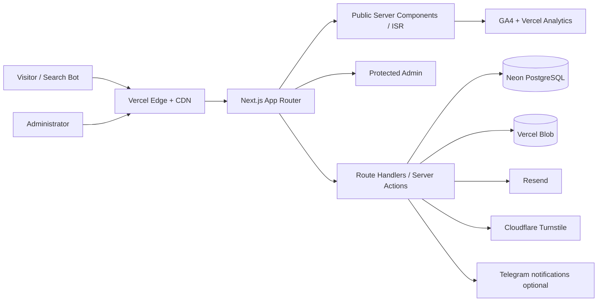
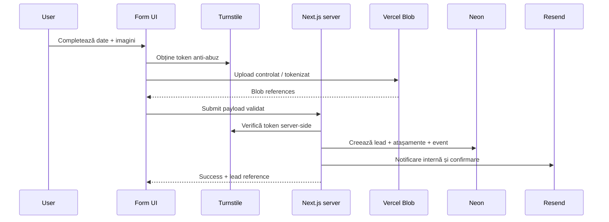

# System Architecture

## Decizii arhitecturale aprobate

- **Platformă:** website premium de lead generation + backoffice editorial/operațional compact; nu marketplace și nu microservicii.
- **Runtime și framework:** Next.js App Router, React, TypeScript strict și runtime Node.js pe Vercel.
- **Frontend public:** design 100% custom; fără template de construcții și fără aspect implicit shadcn/ui.
- **Admin:** interfață funcțională separată; shadcn/ui poate fi folosit doar ca set de primitive administrative, personalizat vizual.
- **Hosting și delivery:** Vercel Pro, cu Development, Preview și Production separate.
- **Bază de date:** Neon PostgreSQL atunci când funcția necesită persistență relațională; Prisma ORM și validare Zod.
- **Media:** Vercel Blob pentru imaginile, documentele și atașamentele controlate de platformă.
- **E-mail:** Resend pentru notificări și e-mail tranzacțional.
- **Anti-abuz:** Cloudflare Turnstile, honeypot, rate limiting și validare server-side.
- **Analytics:** GA4, Google Search Console, Vercel Web Analytics și Speed Insights; Microsoft Clarity doar după consimțământ și validare.
- **Strategie de randare:** Server Components implicit; pagini publice statice/ISR unde este posibil; Client Components doar pentru interactivitate reală.
- **Limbi:** română și rusă la lansare dacă proprietarul confirmă conținutul; engleza rămâne extensie opțională.
- **Principiu:** SEO, accesibilitatea, performanța și conversia au prioritate față de efectele vizuale.

## Stil arhitectural

Monolit modular full-stack în Next.js. Domeniile sunt separate logic în module, dar deploy-ul rămâne unic pe Vercel. Aceasta minimizează costul operațional și maximizează viteza de dezvoltare fără a bloca extracția viitoare a unui serviciu dacă apar cerințe măsurabile.

## Context diagram

## Bounded modules

- Public Experience
- Services & Local Landing Pages
- Portfolio & Media
- Lead Capture & Estimator
- Admin CMS
- CRM Lead Pipeline
- Identity & Access
- SEO & Content
- Analytics & Reporting

Modulele comunică prin servicii interne și contracte tipizate, nu prin importuri circulare între UI și persistence.

## Rendering strategy

| Tip pagină | Strategie |
|---|---|
| homepage, servicii, proiecte, articole | static/ISR cu revalidare on-demand |
| formulare și estimator | shell server-rendered + interactivitate client minimă |
| admin | dinamic, autentificat, fără cache public |
| API/webhooks | Node.js runtime, fără cache |
| sitemap/robots/llms | generate din date publicate și configurare |

## Data flow — lead

## Caching și invalidare

- conținutul public este cacheabil;
- publicarea sau modificarea unei entități declanșează revalidarea tag-urilor relevante;
- admin și lead endpoints nu se cache-uiesc;
- media publică folosește URL-uri stabile și lifecycle controlat;
- nu se execută query DB repetitiv în componente client.

## Error handling

- erori de validare: 4xx și mesaje câmp-specifice;
- erori externe: retry controlat și stare observabilă;
- webhook-uri idempotente;
- upload parțial eșuat: cleanup programat;
- pagina publică nu expune stack traces sau identificatori sensibili.

## Scalability boundaries

Arhitectura suportă creștere verticală prin:

- ISR și CDN;
- connection pooling Neon;
- indexuri și paginare;
- upload direct către Blob;
- cozi nu sunt introduse în P0. Dacă apar sarcini lente/retry-heavy, se creează ADR pentru workflow/queue.

## Observability

- Vercel logs și analytics;
- error tracking `CONFIRM_TECH` (Sentry recomandat dacă bugetul permite);
- audit log pentru admin;
- health checks pentru integrații;
- alerte pentru eșec de notificare și creștere rate error.

## Baza documentară

Acest document derivă din brief-ul inițial și din raportul de research incluse în directorul `../research/`. Sursele externe sunt inventariate în `27-SOURCE-REGISTER.md`. Datele comerciale ale afacerii marcate `CONFIRM_OWNER` nu trebuie publicate înainte de confirmarea proprietarului.
