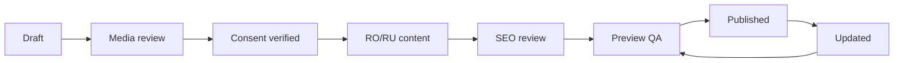

# Portfolio & Case Studies

## Rol strategic

Portofoliul este principalul instrument de diferențiere și trust. Fiecare proiect trebuie să demonstreze proces, precizie și rezultat, nu doar să afișeze o galerie.

## Project content model

- titlu și slug per locale;
- tip proiect și proprietate;
- localitate generală;
- dată/status;
- suprafață și durată, dacă sunt aprobate;
- provocare;
- soluție și etape;
- servicii executate;
- materiale/formate;
- before/during/after;
- detalii de execuție;
- testimonial;
- cost orientativ doar cu aprobare;
- CTA proiect similar;
- consent/publication record.

## Quality Proof Layer

Fiecare proiect premium poate include 3–6 dovezi tehnice:

- alinierea rosturilor;
- colțuri și profile;
- pante și drenaj;
- hidroizolație;
- nișe și decupaje;
- tranziții între materiale.

Fiecare dovadă are fotografie macro și explicație scurtă, fără afirmații tehnice neverificate.

## Media taxonomy

- `cover`;
- `before`;
- `process`;
- `after`;
- `detail`;
- `before_after_left/right`;
- `video`;
- `document` privat dacă este necesar.

## Gallery UX

- cover cu raport controlat;
- imagini responsive și lazy loading;
- lightbox cu tastatură, focus și captions;
- filtrele nu produc duplicate SEO;
- ordinea este editorială, nu ordinea upload-ului;
- buton share și OG image generate din media aprobată.

## Workflow publicare

## Privacy

- fără adresă exactă;
- eliminare EXIF/GPS;
- blur/omit elemente identificabile;
- consimțământ separat pentru client, locuință și testimonial;
- atașamentele lead-ului nu devin automat public media.

## P0 minimum content

Ideal minimum 6 proiecte, dintre care:

- 2 băi complete;
- 2 lucrări gresie/faianță;
- 1 proiect cu detalii tehnice;
- 1 proiect relevant pentru suburbie/comercial, dacă există.

Dacă acest inventar nu există, lansarea folosește mai puține proiecte bine documentate, nu proiecte false sau stock.

## Acceptance criteria

- fiecare proiect are consent status;
- alt text și captions sunt contextualizate;
- media e optimizată și în Vercel Blob;
- proiectul se leagă de servicii și CTA;
- before/after este accesibil;
- pagina are metadata, schema și internal links.
