# Data Model — Neon PostgreSQL

## Principii

- UUID/identificator stabil intern;
- timestamps UTC;
- unique constraints pentru slugs per locale;
- foreign keys și delete behavior explicit;
- soft delete pentru entități operaționale/editoriale unde recuperarea contează;
- audit separat pentru acțiuni sensibile;
- JSON doar pentru configurări flexibile, nu pentru relații principale.

## Entități

### Identity

- `User`
- `Role`
- `UserRole`
- `Session`
- `VerificationToken`

### Leads

- `Lead`
- `LeadStatusHistory`
- `LeadNote`
- `LeadAttachment`
- `LeadTask`
- `LeadNotification`

### Content

- `Project`
- `ProjectTranslation`
- `ProjectMedia`
- `Service`
- `ServiceTranslation`
- `ProjectService`
- `PriceItem`
- `Testimonial`
- `FAQ`
- `FAQTranslation`
- `Article`
- `ArticleTranslation`
- `Locality`
- `LocalityTranslation`
- `Page`
- `PageTranslation`

### Platform

- `MediaAsset`
- `SiteSetting`
- `SocialLink`
- `ContactChannel`
- `ConsentRecord`
- `AuditLog`
- `AnalyticsEventSummary` optional

## Mermaid ER

```mermaid
erDiagram
  USER ||--o{ SESSION : has
  USER ||--o{ AUDIT_LOG : creates
  LEAD ||--o{ LEAD_STATUS_HISTORY : changes
  LEAD ||--o{ LEAD_NOTE : has
  LEAD ||--o{ LEAD_ATTACHMENT : contains
  LEAD ||--o{ LEAD_TASK : schedules
  SERVICE ||--o{ SERVICE_TRANSLATION : translated
  PROJECT ||--o{ PROJECT_TRANSLATION : translated
  PROJECT ||--o{ PROJECT_MEDIA : contains
  MEDIA_ASSET ||--o{ PROJECT_MEDIA : referenced
  PROJECT ||--o{ PROJECT_SERVICE : uses
  SERVICE ||--o{ PROJECT_SERVICE : appears_in
  PROJECT ||--o{ TESTIMONIAL : may_have
  ARTICLE ||--o{ ARTICLE_TRANSLATION : translated
  LOCALITY ||--o{ LOCALITY_TRANSLATION : translated
  PAGE ||--o{ PAGE_TRANSLATION : translated
```

## Indexuri critice

- lead: `status, createdAt`, `nextActionAt`, `phoneNormalized`, `source`, `serviceId`, `localityId`;
- project: `status, publishedAt`, slug per locale, featured;
- service/locality/article: slug per locale și publish state;
- media: blob pathname/key, checksum, orphan state;
- audit: actor/date și entity/date;
- full-text search poate fi introdus doar dacă admin search o justifică.

## Delete policy

| Entitate | Politică |
|---|---|
| Lead | soft delete/anonymize conform retenției |
| Notes/history/audit | append-only, retenție definită |
| Project/Service/Article | archive + soft delete; redirect management |
| MediaAsset | blocat dacă referențiat; hard delete după grace period |
| Session | hard delete/expire |
| Consent | păstrat cât este necesar pentru dovadă |

## Retenție propusă — de validat juridic

- spam: 30–90 zile;
- lead necalificat: 6–12 luni;
- client/proiect: conform obligațiilor contractuale și fiscale;
- audit/admin login: 12–24 luni;
- upload neasociat: 24–72 ore.

## Concurrency și integrity

- transitions de status validate;
- idempotency pentru submit lead;
- optimistic concurrency/version field pentru editări editoriale importante;
- transactions pentru lead + attachment metadata + initial status;
- constraints pentru perechi before/after și ordine media.

## Preview/staging

- branch de DB separată pentru test/staging când este necesar;
- datele de producție nu se copiază în preview fără anonimizare;
- migrations sunt forward-compatible și testate înainte de production.

## Acceptance criteria

- schema acoperă toate fluxurile P0;
- PII este identificată și protejată;
- indexurile au query justification;
- cascade behavior este explicit;
- niciun fișier binar nu este stocat în DB.
