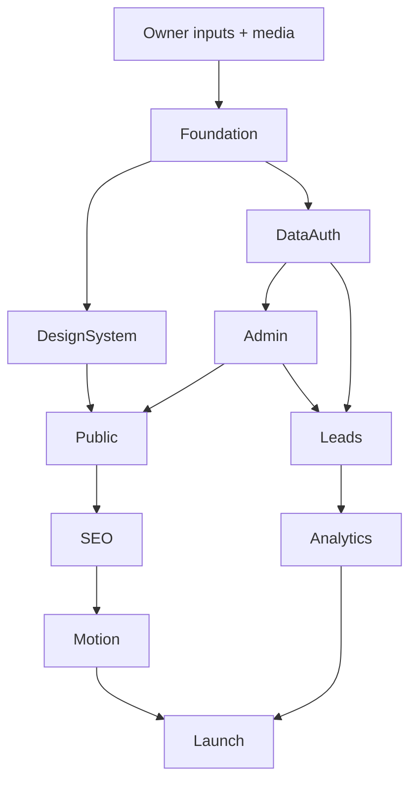

# Master Implementation Plan pentru Claude

## Premisă

Arhitectura este aprobată. Implementarea începe numai după comanda explicită a utilizatorului și după completarea inputurilor critice din `26-OWNER-DISCOVERY-CHECKLIST.md`.

## Workstream 0 — Preflight

1. Citește toate ADR-urile.
2. Identifică `CONFIRM_OWNER` care afectează P0.
3. Creează matricea requirements → document → test.
4. Confirmă denumirea, localele, domeniul și datele de contact.
5. Nu crea UI final înainte de auditul media.

**Exit:** business inputs critice disponibile și scope P0 înghețat.

## Workstream 1 — Foundation

- inițializare Next.js App Router + TypeScript strict;
- conventions, lint/typecheck/test;
- env schema;
- Vercel project și medii;
- Neon/Prisma foundation;
- Blob adapter;
- error handling/logging;
- basic security headers.

**Nu include:** pagini comerciale complete.

**Exit:** build reproducibil pe Preview, fără secrete în client.

## Workstream 2 — Design foundation

- tokens public/admin separate;
- typography și layout primitives;
- buttons, links, forms, media, navigation;
- accessibility states;
- Storybook optional;
- prototype hero/fallback.

**Exit:** homepage, service, project și form pot fi construite fără styling ad-hoc.

## Workstream 3 — Data & identity

- schema conceptuală transpusă în migrations;
- auth admin;
- authorization;
- audit log;
- seed strict de development, fără date fictive prezentate ca reale.

**Exit:** admin protected și DB migration tests verzi.

## Workstream 4 — Content admin

- services;
- projects + translations;
- media library;
- testimonials/FAQ/pages/settings;
- preview/publish/revalidation.

**Exit:** proprietarul poate publica un proiect complet în Preview.

## Workstream 5 — Public P0

Ordine:

1. global layout/header/footer;
2. homepage static baseline;
3. service index/detail;
4. project index/detail;
5. about/process/reviews/FAQ/contact;
6. legal pages;
7. RO/RU routing și metadata.

**Exit:** site complet utilizabil fără motion avansat.

## Workstream 6 — Lead & CRM

- formular rapid;
- cerere avansată;
- Blob attachments;
- Turnstile/rate limit/idempotency;
- Resend/Telegram;
- lead inbox, status history, notes și follow-up;
- analytics events.

**Exit:** lead end-to-end salvat și operabil chiar când notificările externe eșuează.

## Workstream 7 — SEO/analytics/performance

- sitemap/robots/llms;
- structured data;
- Search Console/GA4 hooks;
- performance budgets;
- image optimization;
- accessibility audit;
- Preview noindex.

**Exit:** quality gates P0 verzi.

## Workstream 8 — Cinematic enhancement

- poster first;
- image sequence/parallax;
- capability detection;
- reduced motion/static fallback;
- real device performance.

**Exit:** experiența adaugă impact fără regresie CWV/INP.

## Workstream 9 — Content population & launch

- proiecte reale;
- servicii confirmate;
- traduceri;
- recenzii și consimțământ;
- owner UAT;
- DNS/domain/email authentication;
- soft launch;
- 14 zile monitoring.

## Pull request discipline

Fiecare PR trebuie să aibă:

- scope unic;
- documente sursă;
- screenshots/states relevante;
- tests executate;
- impact SEO/performance/security;
- migration/rollback dacă este cazul;
- lista de `CONFIRM_OWNER` rămase.

## Dependency graph

## Stop conditions

Claude trebuie să se oprească și să raporteze, nu să improvizeze, când:

- lipsește un claim critic;
- o migration poate pierde date;
- o funcție cere expunerea PII;
- media nu are drept de utilizare;
- o schimbare contrazice ADR;
- performanța/SEO este compromisă de design;
- un serviciu extern nu suportă cerința asumată.

## Final release definition

- toate P0 și acceptance criteria;
- UAT proprietar;
- backup/restore/rollback;
- analytics și GSC;
- fără erori critice, broken links, PII leakage sau claims neconfirmate;
- ghid de administrare și handover.
